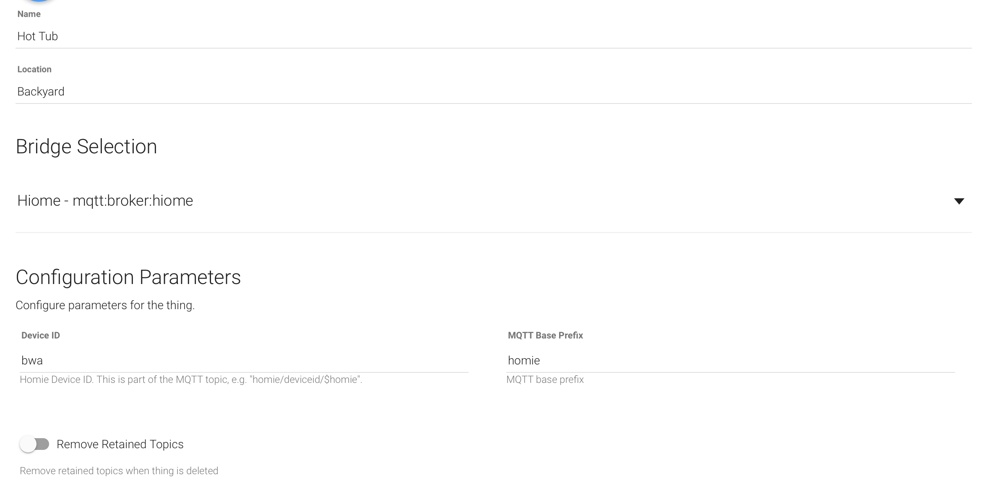
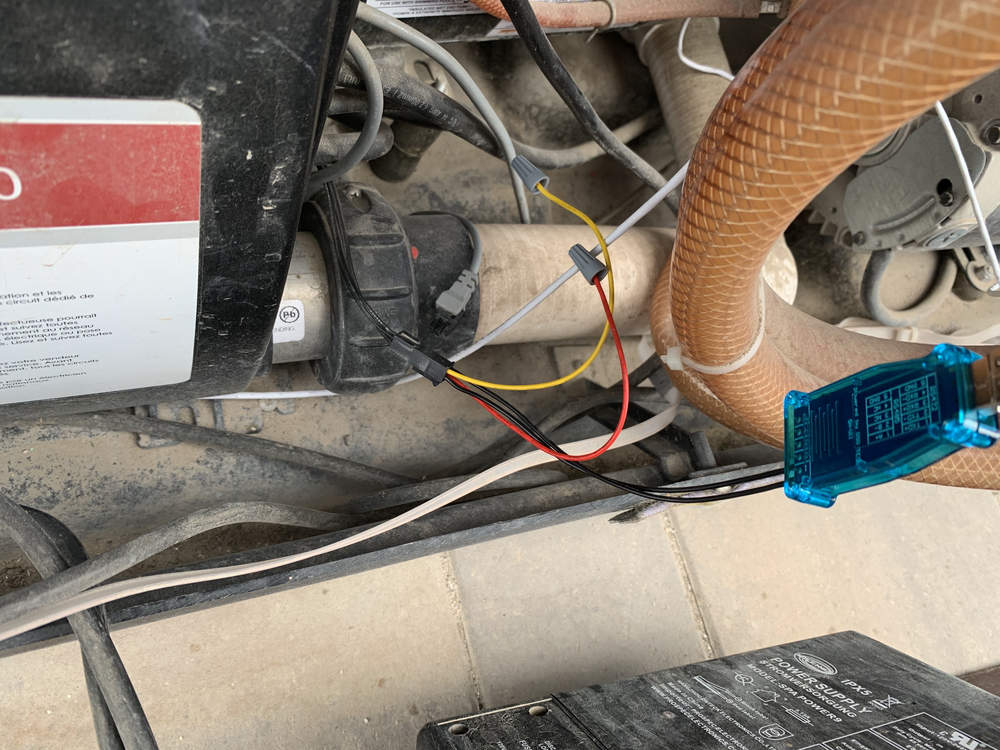
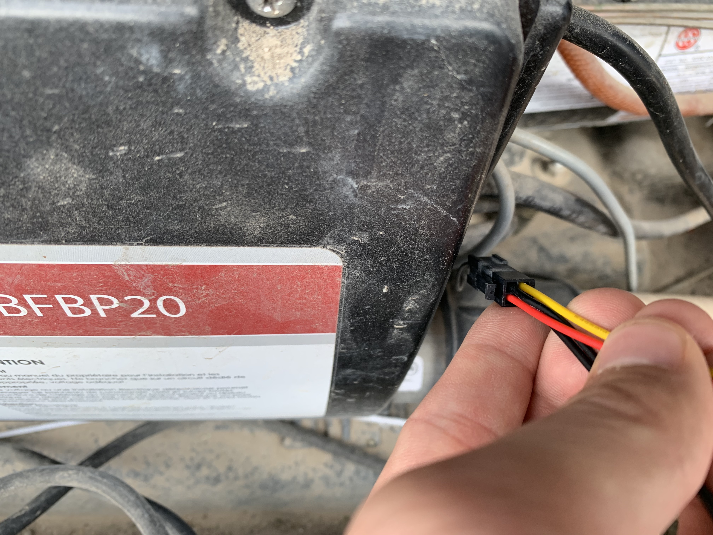

# Balboa Worldwide App gem

This gem is a Ruby library for interacting with Wifi spa controllers from
Balboa Water Group. There is no documentation on the protocol, and it has
been reverse engineered by various individuals from both packet captures
and tapping directly into the controller's communication bus. Not all
messages have been deciphered, nor has automatic configuration been
implemented. At the moment, it assumes two 2-speed pumps, a circ pump, a
heater, and a single lights circuit.

## MQTT/Homie Bridge

An MQTT Bridge is provided to allow easy integration with other systems. You
will need a separate MQTT server running ([Mosquitto](https://mosquitto.org) is
a relatively easy and robust one). The MQTT topics follow the [Homie
convention](https://homieiot.github.io), making them self-describing. If you're
using a systemd Linux distribution, an example unit file is provided in
`contrib/bwa_mqtt_bridge.service`. So a full example would be (once you have
Ruby installed):

```sh
gem install balboa_worldwide_app
sudo curl https://github.com/ccutrer/balboa_worldwide_app/raw/master/contrib/bwa_mqtt_bridge.service -L -o /etc/systemd/system/bwa_mqtt_bridge.service
<modify the file to pass the correct URI to your MQTT server, and path to RS-485 device or hostname/IP for WiFi>
sudo systemctl enable bwa_mqtt_bridge
sudo systmctl start bwa_mqtt_bridge
```

Several properties also accept the non-Homie conforming value of `toggle` to
indicate to cycle through available values, instead of going to a specifc
value. These properties are:

 * heatingmode
 * heatingrange
 * pump*
 * light*

## OpenHAB
If you're going to integrate with OpenHAB, you'll need to install the
`MQTT Binding` in `Add-ons`. Then go to Inbox, click `+`, select `MQTT Binding`
and click `ADD MANUALLY` near the bottom. First create a Thing for the
`MQTT Broker` and configure it to point to your MQTT server. Then go to
manually add again, and choose a `Homie MQTT Device`. Select your bridge, and
for `Device ID` put in `bwa`. Example Thing configuration:



Example Items file (including configuration for exposing to HomeKit):

```
Number HotTubPump1_Speed "Pump 1" <pump> { channel="mqtt:homie300:hottub:spa#pump1", autoupdate="false" }
Number HotTubPump2_Speed "Pump 2" <pump> { channel="mqtt:homie300:hottub:spa#pump2", autoupdate="false" }
Switch HotTubLights_Switch "Hot Tub Lights" <light> (gAllOff, gLights) [ "Lighting" ] { channel="mqtt:homie300:hottub:spa#light1", autoupdate="false" }

String HotTub_HeatingMode "Heating Mode" { channel="mqtt:homie300:hottub:spa#heatingmode", autoupdate="false" }
String HotTub_TemperatureRange "Temperature Range" { channel="mqtt:homie300:hottub:spa#temperaturerange", autoupdate="false" }

Switch HotTubCircPump_Switch "Circ Pump" <pump> { channel="mqtt:homie300:hottub:spa#circpump" }
Switch HotTubHeaterActive_Switch "Heater Active" <fire> { channel="mqtt:homie300:hottub:spa#heating" }

Group gHotTubThermostat "Hot Tub Heater" [ "Thermostat" ]

String HotTub_HomeKitTargetMode (gHotTubThermostat) [ "homekit:TargetHeatingCoolingMode" ]
String HotTub_HomeKitCurrentMode (gHotTubThermostat) [ "homekit:CurrentHeatingCoolingMode" ]

Number:Temperature HotTub_CurrentTemp <temperature> (gHotTubThermostat) [ "CurrentTemperature" ] { channel="mqtt:homie300:hottub:spa#currenttemperature" }
Number:Temperature HotTub_SetTemp <temperature> (gHotTubThermostat) [ "TargetTemperature" ] { channel="mqtt:homie300:hottub:spa#settemperature", autoupdate="false" }
```

Example Rules file for maintaining HomeKit state:

```
rule "HomeKit Control"
when
  Item HotTubHeaterActive_Switch changed
then
  if (triggeringItem.state == OFF) {
    HotTub_HomeKitCurrentMode.postUpdate("OFF")
  } else {
    HotTub_HomeKitCurrentMode.postUpdate("HEAT")
  }
end
```

Example sitemap snippet:
```
Frame label="Hot Tub" {
    Switch item=HotTubLights_Switch label="Lights"
    Setpoint item=HotTubPump1_Speed minValue=0 maxValue=2 step=1
    Setpoint item=HotTubPump2_Speed minValue=0 maxValue=2 step=1
    Setpoint item=HotTub_SetTemp label="Set Point" minValue=80 maxValue=104 step=1
    Text item=HotTub_CurrentTemp label="Temperature"
    Text item=HotTub_HeatingMode
    Text item=HotTub_TemperatureRange
    Text item=HotTubCircPump_Switch
    Text item=HotTubHeaterActive_Switch
}
```

## Using RS-485 for a direct connection

This gem supports using an RS-485 direct connection to the hot tub if you don't have the Wifi module, or would simply like something more reliable. It is possible to directly connect to the GPIO on a Raspberry Pi, or to use a USB RS-485 dongle such as [this one from Amazon](https://www.amazon.com/gp/product/B07B416CPK). The key is identifying the correct wires as RS-485+ and RS-485-. There should be a small connector coming out of your control box. It's compatible with an [ATX micro-fit connector](https://www.amazon.com/gp/product/B07Z7X5KW1). You can also purchase a Y-cable such as [this one](https://spacare.com/BalboaWaterGroupWi-FiY-CableSplitter25657.aspx) if you already have something connected to the port, and want to keep it connected (or spy on its communication). Note that the colors may not be the same on any adapter or pigtail you find. Here's a photo of mine connected to the dongle:



As you can see in my case, the two black wires ended up being RS-485. The surefire way to test is to break out a multimeter and compare pairs of wires. One set of opposite pins should show 12-14V. Once you've found that keep one probe on the negative end, and try the other two wires. They should both read 2-3V. The slightly higher one will be RS-485+, and the slightly lower one will be RS-485-. You don't have to fret too much on getting them right (as long as you don't hook up the +12V line!) - you'll just get garbage if you swap + and -. Swap them back and you should be good. Here's a closer view of the header where you can see that the black wires (RS-485) are top-left and bottom-right when viewed looking into the connector, with the latch on the left.



## Related Projects

These projects are all in various states, and may be more or less developed than this one in varying aspects.

 * https://github.com/rsrawley/spaControl - Node.js server with socket.io API and other customizations
 * https://github.com/garbled1/pybalboa/ - Python library
 * https://github.com/plmilord/Hass.io-custom-component-spaclient = Hass.io integration
 * https://github.com/MHotchin/BalboaSpaComms - C++/Windows

## Thanks

 * @garbled1 for figuring out the checksums
 * @rsrawley for [details on connecting RS-485](https://docs.google.com/document/d/1s4A0paeGc89k6Try2g3ok8V9BcYm5CXhDr1ys0qUT4s/edit?usp=drivesdk&authuser=0) and his [javascript code](https://github.com/rsrawley/spaControl) that decoded a few of the local bus only messages, and the insight that you can only send messages when the controller is ready in that mode.
